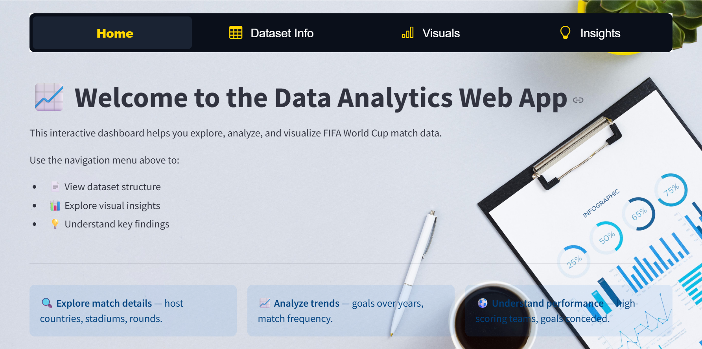

# Football DataAnalysis_Project
This project focuses on Exploratory data analysis(EDA) of football dataset showing key insigths and trends. Interactive visualizations are created using plotly.
# Technologies used
- Python
- Pandas
- NumPy
- Plotly

Site Preview

